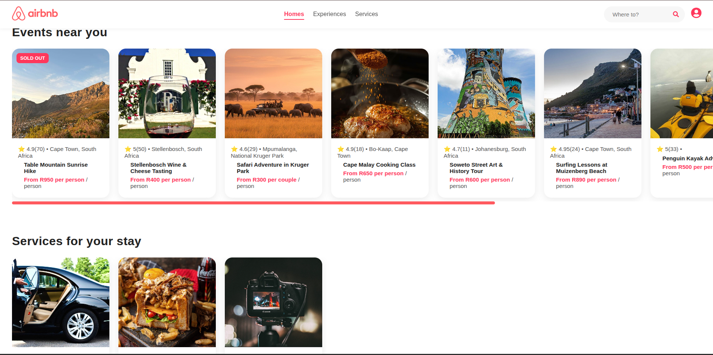

# AirBnB Clone

🏠 Airbnb Clone – Full-Stack Web Application

A full-stack Airbnb clone that allows users to list, search, and book accommodations. The application replicates core Airbnb functionality with a modern frontend and a scalable backend.

🚀 Features

🏡 Create and manage property listings

🔍 Search accommodations dynamically

📸 Upload and display property images

📅 Real-time booking functionality

🔄 Dynamic routing for listings and bookings

📱 Responsive user interface

🛠️ Tech Stack
Frontend

React

JavaScript (ES6)

CSS

Backend

Node.js

Express

RESTful APIs

(Optional: Add your database here if applicable — MongoDB, PostgreSQL, etc.)

📂 Project Structure
airbnb-clone/
│
├── client/            # React frontend
│   ├── src/
│   └── public/
│
├── server/            # Node.js & Express backend
│   ├── routes/
│   ├── controllers/
│   └── middleware/
│
└── README.md

⚙️ How It Works

Users can create accounts and list properties with images.

Listings are dynamically rendered using React routing.

The backend handles property data, bookings, and image uploads.

Real-time booking logic ensures availability consistency.

REST APIs connect the frontend and backend seamlessly.

▶️ Getting Started
1. Clone the Repository
git clone https://github.com/your-username/airbnb-clone.git

2. Install Dependencies
Frontend
cd client
npm install
npm start

Backend
cd server
npm install
npm run dev

3. Open in Browser
http://localhost:3000

📸 Screenshots

Make sure screenshots are added to your repository and paths are correct.

🚧 Limitations

Payment processing not implemented

Authentication may be basic (if applicable)

Booking logic simplified for demonstration purposes

🔮 Future Improvements

💳 Payment integration (Stripe)

🔐 Advanced authentication & authorization

🌍 Map-based search

⭐ Reviews & ratings

🏷️ Price filtering and availability calendar

👤 Author

Prosperous Dibakoane
Software Engineering Student

📄 License

This project is open-source and available under the MIT License.🏠 Airbnb Clone – Full-Stack Web Application

A full-stack Airbnb clone that allows users to list, search, and book accommodations. The application replicates core Airbnb functionality with a modern frontend and a scalable backend.

🚀 Features

🏡 Create and manage property listings

🔍 Search accommodations dynamically

📸 Upload and display property images

📅 Real-time booking functionality

🔄 Dynamic routing for listings and bookings

📱 Responsive user interface

🛠️ Tech Stack
Frontend

React

JavaScript (ES6)

CSS

Backend

Node.js

Express

RESTful APIs

(Optional: Add your database here if applicable — MongoDB, PostgreSQL, etc.)

📂 Project Structure
airbnb-clone/
│
├── client/            # React frontend
│   ├── src/
│   └── public/
│
├── server/            # Node.js & Express backend
│   ├── routes/
│   ├── controllers/
│   └── middleware/
│
└── README.md

⚙️ How It Works

Users can create accounts and list properties with images.

Listings are dynamically rendered using React routing.

The backend handles property data, bookings, and image uploads.

Real-time booking logic ensures availability consistency.

REST APIs connect the frontend and backend seamlessly.

▶️ Getting Started
1. Clone the Repository
git clone https://github.com/your-username/airbnb-clone.git

2. Install Dependencies
Frontend
cd client
npm install
npm start

Backend
cd server
npm install
npm run dev

3. Open in Browser
http://localhost:3000

📸 Screenshots

Make sure screenshots are added to your repository and paths are correct.

🚧 Limitations

Payment processing not implemented

Authentication may be basic (if applicable)

Booking logic simplified for demonstration purposes

🔮 Future Improvements

💳 Payment integration (Stripe)

🔐 Advanced authentication & authorization

🌍 Map-based search

⭐ Reviews & ratings

🏷️ Price filtering and availability calendar

👤 Author

Prosperous Dibakoane
Software Engineering Student

📄 License

This project is open-source and available under the MIT License.🏠 Airbnb Clone – Full-Stack Web Application

A full-stack Airbnb clone that allows users to list, search, and book accommodations. The application replicates core Airbnb functionality with a modern frontend and a scalable backend.

🚀 Features

🏡 Create and manage property listings

🔍 Search accommodations dynamically

📸 Upload and display property images

📅 Real-time booking functionality

🔄 Dynamic routing for listings and bookings

📱 Responsive user interface

🛠️ Tech Stack
Frontend

React

JavaScript (ES6)

CSS

Backend

Node.js

Express

RESTful APIs

(Optional: Add your database here if applicable — MongoDB, PostgreSQL, etc.)

📂 Project Structure
airbnb-clone/
│
├── client/            # React frontend
│   ├── src/
│   └── public/
│
├── server/            # Node.js & Express backend
│   ├── routes/
│   ├── controllers/
│   └── middleware/
│
└── README.md

⚙️ How It Works

Users can create accounts and list properties with images.

Listings are dynamically rendered using React routing.

The backend handles property data, bookings, and image uploads.

Real-time booking logic ensures availability consistency.

REST APIs connect the frontend and backend seamlessly.

▶️ Getting Started
1. Clone the Repository
git clone https://github.com/your-username/airbnb-clone.git

2. Install Dependencies
Frontend
cd client
npm install
npm start

Backend
cd server
npm install
npm run dev

3. Open in Browser
http://localhost:3000

📸 Screenshots

Make sure screenshots are added to your repository and paths are correct.

🚧 Limitations

Payment processing not implemented

Authentication may be basic (if applicable)

Booking logic simplified for demonstration purposes

🔮 Future Improvements

💳 Payment integration (Stripe)

🔐 Advanced authentication & authorization

🌍 Map-based search

⭐ Reviews & ratings

🏷️ Price filtering and availability calendar

👤 Author

Prosperous Dibakoane
Software Engineering Student

📄 License

This project is open-source and available under the MIT License.

